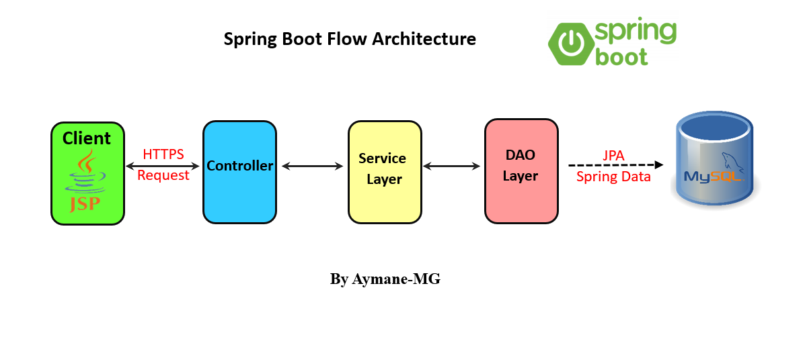
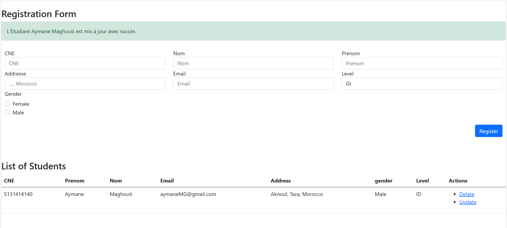

# Student Management System with Spring Boot

## Table of Contents

1. [Overview](#overview)
2. [Architecture](#architecture)
3. [Features](#features)
4. [Technologies Used](#technologies-used)
5. [Installation](#installation)
6. [Usage](#usage)
7. [Contact](#contact)

## Overview
This is a simple application for managing student records built with Spring Boot. It provides basic CRUD (Create, Read, Update, Delete) functionality for student entities.

## Architecture
- The application follows a layered architecture pattern:

 

## Features
- Add new students with details like name, email, adresse...
- View a list of all students.
- Update student information.
- Delete student records.

- The Ui : 

 

## Technologies Used
- Java
- Spring Boot
- Spring Data JPA
- MySQL
- JSP
- Bootstrap
- Maven

## Installation
1. Clone this repository.
2. Ensure you have MySQL installed and running on your system.
3. Create a MySQL database for the application. (`create database gs_etudiants`)
4. Update the `application.properties` file in the `src/main/resources` directory with your database configuration.
5. Build the project using Maven.
6. Run the application.

**Note** : This repository also contains a version of the student management system implemented with Spring. If you prefer the Spring version, please refer to the appropriate directory.

## Contact
- **Name:** Aymane Maghouti
- **Email:** aymanemaghouti16@gmail.com
- **LinkedIn:** <a href="https://www.linkedin.com/in/aymane-maghouti/" target="_blank">Aymane Maghouti</a> 

